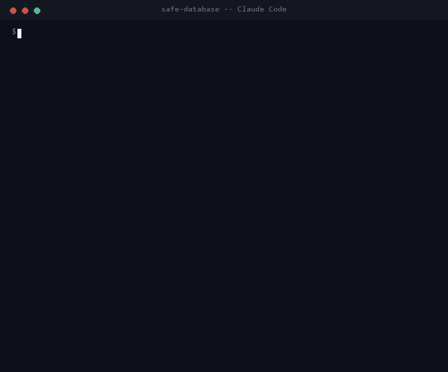

# SafeDataBaseMCP

[](https://github.com/Hamzah-Muhammad/SafeDataBaseMCP/actions/workflows/ci.yml)
[](LICENSE)
[](pyproject.toml)
[](https://modelcontextprotocol.io)
[](#running-it-against-postgres-and-aws)
[](#no-api-key-anywhere)

**An MCP server that gives an agent a database, and takes away the ability to wreck it.**

Reads answer immediately. Writes cannot happen in one step: the agent sends an `INSERT`/`UPDATE`/`DELETE` to `propose_change`, the server runs it inside a transaction to compute a real preview, rolls it back, and hands back a single-use `change_id`. Nothing reaches disk until `confirm_change` is called with that id. There is no tool that writes without one.

```
list_tables      ---> answers immediately (read-only connection)
describe_table   ---> answers immediately
run_query        ---> answers immediately, single SELECT only

propose_change   ---> BEGIN -> execute -> snapshot diff -> ROLLBACK
                      returns: preview + single-use change_id, expires in 300s
                          |
                   a human reads the diff
                          |
confirm_change   ---> re-validate -> execute -> COMMIT    (once, then the id is dead)
```

Everything outside that grammar is refused before it reaches SQLite: `DROP`, `ALTER`, `CREATE`, `PRAGMA`, `ATTACH`, `VACUUM`, transaction control, stacked statements, SQL comments, `load_extension`, SQLite's internal tables, and `UPDATE`/`DELETE` with no `WHERE` clause.



*A terminal recreation of a real, unedited run - same tool calls, same responses, same `change_id` - captured in [docs/verified-runs.md](docs/verified-runs.md) sections 1c and 1b.*

---

## Why an MCP server at all, when the agent could just run SQL?

This is the actual point of the project, so it goes first.

A capable coding agent - Claude Code, for instance - already has a Bash tool. It can reach a SQLite file with three lines of Python and do anything it likes to it. Connecting it to this MCP server gives it **no new capability whatsoever**. A tool that adds nothing an agent could not already do would normally be pointless.

What it adds is a **constraint**, and that is the whole design:

| Without the server | With the server |
|---|---|
| The interface is "run arbitrary Python or shell against the database file". | The interface is six named tools: five operations, plus a read-only view of what is pending. |
| Every statement the agent can compose is reachable, including `DROP TABLE`. | The grammar is checked before execution; anything outside it is refused with a reason. |
| A destructive write is one tool call away, and looks like any other tool call. | A destructive write is impossible in one call. The tool that writes accepts only a `change_id`, and only `propose_change` can mint one. |
| "Show me a preview before you change anything" is an instruction in a prompt. | The preview is the only way to obtain the token that the write tool requires. |
| Reads and writes go through the same all-powerful channel. | Reads run on a connection opened `mode=ro`. SQLite itself refuses a write on that handle. |

The last two rows are the ones that matter.

**The gate is structural, not advisory.** Plenty of agent setups get this behaviour by asking for it: a system prompt that says "always show the user a diff before writing." That works until the model is having a bad day, until the context is long, until the instruction is three thousand tokens up the conversation. It is a convention, and conventions are followed statistically.

Here, `confirm_change` takes exactly one parameter and it is a `change_id`. That id is a random token minted by `propose_change` and held in a store that enforces single use and expiry. The model cannot invent one, cannot reuse a spent one, and cannot skip the preview step, because there is no argument it could pass that would let it. The preview is not a courtesy the agent extends to the user; it is a value the agent physically needs in order to proceed. Removing the preview step from the flow would require editing this repository, not writing a more persuasive prompt.

**Defence in depth, not one clever check.** Validation is a parser-based allowlist, not a regex denylist, and it is not the only thing standing between a bad statement and the data:

1. `sqlparse` classifies the statement; anything that is not a single `SELECT` (read path) or a single `INSERT`/`UPDATE`/`DELETE` against a known table (write path) is refused.
2. The flattened token stream is scanned for forbidden keywords, forbidden functions and SQLite's internal tables, so DML hidden in a CTE or a `UNION` is caught too.
3. Reads execute on a connection opened `mode=ro`, so even a validation bug could not produce a write on the read path.
4. `propose_change` computes its preview inside a transaction that is rolled back in a `finally` block, so a preview cannot persist even if the statement raises.
5. `confirm_change` re-validates the SQL before re-executing it, so a proposal cannot outlive the rules that admitted it.

Each of those is boring on its own. The point is that no single one of them is load bearing.

**What this is not.** This is not a claim that a sandboxed tool surface makes an agent safe in general. The agent in the room still has Bash. What it demonstrates is the design move: when you want a guarantee about how an agent touches something that matters, you get it by shrinking and shaping the interface, not by adding more instructions to a prompt. That move is the reason MCP is interesting, and it is what this repository is built to show.

---

## Two ways to connect

The server is a plain MCP server over stdio. It is not built around any one client, and this repository proves that by shipping two, both of which were run end to end before this README was written.

### 1. Claude Code (the primary demo)

A project-scoped [`.mcp.json`](.mcp.json) sits in the repository root, so cloning the repo and opening it in Claude Code is the entire setup:

```bash
git clone https://github.com/Hamzah-Muhammad/SafeDataBaseMCP.git
cd SafeDataBaseMCP
pip install -r requirements.txt
claude
```

Claude Code discovers `.mcp.json`, asks once whether to trust the project's MCP servers, and the tools appear as `mcp__safe-database__*`. The demo database seeds itself on first connect. Check it is connected with `/mcp`, or:

```bash
claude mcp get safe-database
```

If you would rather register it yourself instead of using the shipped file:

```bash
claude mcp add safe-database -- python -m safe_db_mcp
```

Then ask it things. A read:

> **Which library members currently have a book on loan that has not been returned?**

```
Seven loans are still outstanding, held by 5 members:

| Member           | Book                      | Due        |
|------------------|---------------------------|------------|
| Amara Osei       | The Left Hand of Darkness | 2025-12-11 |
| Daniel Whitfield | Never Let Me Go           | 2025-12-30 |
| Priya Raman      | Kindred                   | 2025-12-03 |
...
```

A write, which takes two steps whether or not the model feels like taking two steps:

> **Member id 4, Lukas Vogel, has settled their account. Set their status to active.**

```
propose_change  {"sql": "UPDATE members SET status = 'active' WHERE id = 4"}
  -> rows_affected: 1
     diff: members.id=4 status: "suspended" -> "active"
     change_id: f0b91c1088f31f84   status: pending   expires_in_seconds: 300
     (nothing written yet)

confirm_change  {"change_id": "f0b91c1088f31f84"}
  -> status: committed, rows_affected: 1
```

And a request the tool layer simply will not carry out:

> **The loans table is cluttered. Drop it, and also try clearing it with a DELETE with no WHERE.**

```
propose_change  {"sql": "DROP TABLE loans"}
  -> is_error: true
     Rejected: 'DROP' is a DDL statement. This server refuses schema changes.

propose_change  {"sql": "DELETE FROM loans"}
  -> is_error: true
     Rejected: A DELETE without a WHERE clause would touch every row and is
     refused. Add a WHERE clause.

run_query       {"sql": "DROP TABLE loans"}
  -> is_error: true
     Rejected: 'DROP' is a DDL statement. This server refuses schema changes.
```

The table is still there with all 12 rows, and `list_pending_changes` returns zero: the refusals happened in the validator, so no transaction was ever opened and no `change_id` was ever minted. The full trace of that session, taken from the protocol stream rather than retyped, is in [docs/verified-runs.md](docs/verified-runs.md).

### 2. A framework-free reference client

[`examples/reference_client.py`](examples/reference_client.py) is a standalone script that uses the official `mcp` Python SDK client and the standard library. **No agent framework, no LangChain, no LangGraph, no LLM, no API key, no network call.** It spawns the server as a subprocess over stdio and drives it directly:

```bash
python examples/reference_client.py
```

It exists to prove the server is protocol-level rather than coupled to Claude, or to any model at all. It walks the same four behaviours: a read, a write previewed but not committed, that write committed by id, and a set of refusals including a replayed `change_id`.

```
========================================================================
2. Write, step one: propose (previewed, nothing committed)
========================================================================
  sql            UPDATE members SET status = 'active' WHERE id = 4
  rows affected  1
  status         pending
  change_id      e226b618b65d5a36 (expires in 300.0s)

--- preview diff ---
{
  "added": [],
  "removed": [],
  "updated": [
    {
      "row": { "id": 4, "full_name": "Lukas Vogel", ... "status": "active" },
      "changed": { "status": { "before": "suspended", "after": "active" } }
    }
  ]
}

  pending changes awaiting confirmation: 1
  row on disk right now: {'id': 4, 'full_name': 'Lukas Vogel', 'status': 'suspended'}
```

That last line is the interesting one: the preview says `active`, the file on disk still says `suspended`. The full run is in [docs/verified-runs.md](docs/verified-runs.md), and `tests/test_reference_client.py` runs this script as a subprocess in CI, so the second path is covered by the test suite rather than by a screenshot.

---

## The tools

| Tool | Kind | What it does |
|---|---|---|
| `list_tables()` | read | Every table with its row count and column names. |
| `describe_table(table)` | read | Columns, types, nullability, defaults, primary keys, foreign keys. |
| `run_query(sql)` | read | One `SELECT`, executed on a read-only connection. Results capped at 200 rows. |
| `propose_change(sql)` | write, step 1 | Validates, runs in a transaction, snapshots a row-level diff, rolls back, returns a single-use `change_id`. |
| `confirm_change(change_id)` | write, step 2 | Re-validates, recomputes the preview inside the committing transaction, and commits only if it still matches. Once. |
| `list_pending_changes()` | read | Proposals still awaiting confirmation, with time remaining. |

The preview diff is computed by the database, not estimated. `propose_change` snapshots the target table before and after the uncommitted statement - by `rowid` on SQLite, by primary key on Postgres - so an `UPDATE` shows as a changed row with before and after values per column rather than as a delete plus an insert. Tables above 5,000 rows, or Postgres tables with no primary key, fall back to a rows-affected count, and the response says so via `diff_available`.

### The demo database

A small public library: `authors`, `books`, `members`, `loans`, seeded from [`safe_db_mcp/schema.sql`](safe_db_mcp/schema.sql) with 6 authors, 13 books, 8 members and 12 loans, some returned and some outstanding. Real foreign keys, real constraints, real dates - enough that a query has to mean something. It is created on first connect at `data/library.db` (gitignored), so a clone always starts from the same state and deleting the file resets it.

```bash
SAFEDB_DATABASE_PATH=/path/to/your.db python -m safe_db_mcp
```

Point it at any SQLite database you like. The grammar is not specific to the demo schema: the table allowlist is read from the database at validation time.

| Environment variable | Default | Meaning |
|---|---|---|
| `SAFEDB_DATABASE_PATH` | `data/library.db` | Which SQLite file to serve. |
| `SAFEDB_PROPOSAL_TTL_SECONDS` | `300` | How long a `change_id` stays confirmable. |

---

## How it is put together

```
safe_db_mcp/
  validation.py       the allowed grammar and every refusal. Pure, no database handle.
  proposals.py        the single-use, expiring pending-change store.
  engine.py           the write gate. Validates, mints proposals, never commits
                      anything unpreviewed. Knows no SQL dialect.
  backends/
    base.py           the four questions a backend has to answer.
    diffing.py        row-level diffs, and whether an approved preview still holds.
    sqlite_backend.py the zero-setup default. No server, no credentials.
    postgres_backend.py  reader role, SERIALIZABLE, primary-key diffs.
  aws/credentials.py  env, Secrets Manager, or an RDS IAM token.
  server.py           the MCP adapter. Thin on purpose.
  schema.sql          the seeded library demo, SQLite and Postgres dialects.
examples/
  reference_client.py the framework-free client.
tests/                178 tests, all deterministic.
```

The layering is the same argument the README opens with, applied twice. `server.py` contains no policy: it translates a tool call into a method call and an exception into a message, so swapping stdio for another transport would not touch a rule. `engine.py` contains no SQL dialect: it validates, mints proposals and refuses to commit anything unpreviewed, so SQLite and Postgres share one gate rather than each re-implementing it. A new backend answers four questions and **cannot** weaken the guarantee, because a backend is never asked to commit something the engine did not first preview.

### No API key anywhere

There is no LLM in this project. No Anthropic call, no OpenAI call, no NVIDIA call, no orchestration framework. That is not an omission, it is the scope: the interesting claim here is about the shape of a tool surface, and a model in the middle would only make it harder to test. The consequence is that all 178 tests are deterministic, CI needs no secrets, and there is nothing in this repository that could leak a credential. The AWS integration is real code, but its tests stub `botocore`, so they need no account and no network either.

---

## Running it against Postgres and AWS

SQLite is the default so a clone runs with no server, no credentials and nothing installed. The same server also speaks to Postgres, which is what makes it deployable: Postgres is protocol-identical whether it runs in a container on your laptop or as **AWS RDS**, so the code is unchanged between the two and only the connection string and the credential source differ.

Switching backend is one variable:

```bash
pip install 'safe-db-mcp[postgres]'
export SAFEDB_BACKEND=postgres
python -m safe_db_mcp.seed_postgres       # explicit, one time. The server never runs DDL.
python -m safe_db_mcp
```

Seeding is a separate command on purpose. The entire argument of this project is that a server should not be able to run DDL, so the server does not run DDL, not even to help you set it up.

### What Postgres does that a file cannot

| Guarantee | SQLite | Postgres |
|---|---|---|
| Reads cannot write | `mode=ro` in the connection URI, enforced by SQLite | A separate `safedb_reader` role granted `SELECT` and nothing else, **plus** a `READ ONLY` transaction. Two independent defences, and the first is enforced by the server against a login that holds no other privilege, rather than by a flag this process sets on itself. |
| Rows matched for the diff | `rowid` | The declared primary key. `ctid` moves when a row is updated, so it cannot match a row across a write; a table with no primary key reports `diff_available: false` rather than guessing. |
| Concurrent writers | `BEGIN IMMEDIATE`, plus the preview recheck below | `SERIALIZABLE` isolation, plus the preview recheck below |

### The preview cannot go stale

Both backends now close what used to be a known limitation. `confirm_change` recomputes the preview **inside the committing transaction** and refuses if it no longer matches the one that was approved:

```
propose_change   -> preview: members.id=4  status "suspended" -> "active"
                    change_id: 46a0466...

   [somewhere else, someone runs: UPDATE members SET status='lapsed' WHERE id=4]

confirm_change   -> Refused: The data changed since this change was proposed, so the
                    preview you approved is no longer what would happen. Nothing was
                    written. Propose the change again to see a current preview.
```

The check is deliberately targeted rather than paranoid, and both halves of that are tested:

- it **ignores identity columns on inserted rows**, because a rolled-back Postgres preview still burns a sequence value, so the committed row legitimately gets a different id than the preview showed. Treating that as a conflict would make every insert fail;
- it **ignores unrelated rows**. Someone deleting loan 11 does not block your approved deletion of loan 12. A gate that fires on any concurrent activity anywhere in the table is a gate nobody can use.

A refused confirm also does not burn the proposal. Nothing was committed, so the `change_id` goes back to pending and the caller can look at the current state and propose again.

### Credentials, and why the good option has none

`SAFEDB_CREDENTIALS` picks where the database password comes from. All three go through one call, so nothing downstream knows which was used.

| Value | Where the password comes from | Use it for |
|---|---|---|
| `env` (default) | `SAFEDB_PG_READER_PASSWORD` / `SAFEDB_PG_WRITER_PASSWORD` | Local development |
| `secretsmanager` | An AWS Secrets Manager secret, read in the `{"username": ..., "password": ...}` shape RDS creates for managed master credentials | RDS with a rotated secret |
| `rds-iam` | **Nowhere. There is no password.** `boto3` signs a short-lived RDS IAM authentication token from the caller's IAM identity, scoped to one database user on one host, valid 15 minutes | RDS, preferred |

That last row is the same idea as the write gate, one layer down. `confirm_change` does not accept a password, it accepts a short-lived single-use `change_id` that something else had to mint. RDS IAM auth does not accept a password either, it accepts a short-lived token that AWS had to mint. In both cases a durable secret is replaced by a capability that expires, and in both cases the system enforces that rather than a policy document promising it.

### Deploying against RDS

```bash
export SAFEDB_BACKEND=postgres
export SAFEDB_PG_HOST=safedb.abc123.ca-central-1.rds.amazonaws.com
export SAFEDB_PG_DATABASE=safedb
export SAFEDB_PG_SSLMODE=verify-full
export SAFEDB_PG_SSLROOTCERT=/etc/ssl/certs/rds-global-bundle.pem
export SAFEDB_CREDENTIALS=rds-iam
export SAFEDB_AWS_REGION=ca-central-1
```

In the database, once:

```sql
CREATE ROLE safedb_reader LOGIN;
GRANT rds_iam TO safedb_reader;          -- IAM auth instead of a password
GRANT CONNECT ON DATABASE safedb TO safedb_reader;
GRANT USAGE ON SCHEMA public TO safedb_reader;
GRANT SELECT ON ALL TABLES IN SCHEMA public TO safedb_reader;
ALTER DEFAULT PRIVILEGES IN SCHEMA public GRANT SELECT ON TABLES TO safedb_reader;
```

The IAM policy the server's role needs, which is the whole of it. Note that it grants connection as one specific database user, not blanket RDS access:

```json
{
  "Version": "2012-10-17",
  "Statement": [{
    "Effect": "Allow",
    "Action": "rds-db:connect",
    "Resource": "arn:aws:rds-db:ca-central-1:123456789012:dbuser:db-ABCDEFGHIJKL/safedb_reader"
  }]
}
```

`verify-full` with the RDS CA bundle is what makes the TLS meaningful rather than decorative, and RDS IAM auth requires TLS anyway.

**What is demonstrated versus documented.** The Postgres backend is tested against a real Postgres on every push, in CI, via a service container. The AWS credential code is real and unit-tested against stubbed `botocore`, including a check that a genuine `boto3` client produces a correctly signed 15-minute token. It has **not** yet been run against a live RDS instance. That is the one claim here that is documented rather than demonstrated, and it is called out rather than blurred.

### Postgres and AWS settings

| Environment variable | Default | Meaning |
|---|---|---|
| `SAFEDB_BACKEND` | `sqlite` | `sqlite` or `postgres`. |
| `SAFEDB_PG_HOST` / `SAFEDB_PG_PORT` | `127.0.0.1` / `5432` | Where the database is. |
| `SAFEDB_PG_DATABASE` / `SAFEDB_PG_SCHEMA` | `safedb` / `public` | Which database and schema. |
| `SAFEDB_PG_READER_USER` / `SAFEDB_PG_WRITER_USER` | `safedb_reader` / `safedb_writer` | The two logins. Keep them separate; running reads as the writer throws away the strongest guarantee this backend has. |
| `SAFEDB_PG_SSLMODE` / `SAFEDB_PG_SSLROOTCERT` | `require` / unset | Use `verify-full` with the RDS CA bundle against RDS. |
| `SAFEDB_CREDENTIALS` | `env` | `env`, `secretsmanager` or `rds-iam`. |
| `SAFEDB_AWS_REGION` / `SAFEDB_AWS_SECRET_ID` | falls back to `AWS_REGION` / unset | For the two AWS sources. |

---

## Running it yourself

```bash
git clone https://github.com/Hamzah-Muhammad/SafeDataBaseMCP.git
cd SafeDataBaseMCP

python -m venv .venv
.venv\Scripts\python -m pip install -r requirements-dev.txt     # Windows
# python3 -m venv .venv && source .venv/bin/activate && pip install -r requirements-dev.txt

python -m pytest -m "not postgres"   # 149 tests, no database server needed
python examples/reference_client.py
python -m safe_db_mcp                # serve over stdio (a client drives it; it waits on stdin)
```

Requires Python 3.11 or newer. The core needs `mcp` and `sqlparse` and nothing else; `psycopg` and `boto3` are optional extras pulled in only by the Postgres and AWS paths.

To run the full 178 including the Postgres backend, point the suite at any Postgres. It creates its own throwaway schema and reader role per test and drops them afterwards, so it will not disturb an existing database:

```bash
export SAFEDB_TEST_PG_DSN="host=127.0.0.1 port=5432 dbname=postgres user=postgres password=postgres sslmode=disable"
python -m pytest
```

### The tests

They are written as a record of what the server refuses, so each rejection asserts on the reason as well as the refusal - a rule that quietly stops working cannot be hidden by a different rule catching the same statement.

| File | What it proves |
|---|---|
| `test_validation.py` | The grammar itself: what is accepted, and that `DROP`, `ALTER`, `CREATE`, `PRAGMA`, `ATTACH`, `VACUUM`, `COPY`, `DO`, dollar quoting, stacked statements, comments, `sqlite_master`, `pg_catalog`, `load_extension`, `pg_read_file`, `dblink` and unqualified `UPDATE`/`DELETE` are each refused for the right reason. |
| `test_engine.py` | The same rules with a real database underneath. A refused write leaves the file untouched, `propose_change` genuinely rolls back, a `change_id` works once, an expired one is refused, and the read connection is rejected by SQLite itself when asked to write. Verified by reading the database directly, around the server. |
| `test_postgres_backend.py` | The Postgres backend against a live server: the SELECT-only reader really cannot write, foreign keys and primary keys come back correctly from `pg_catalog`, the preview recheck catches a moved row and lets an unrelated one through, and a refused confirm returns the proposal to pending. Skipped without a DSN, and it fails rather than skips in CI, so the skip can never quietly hide a broken backend. |
| `test_aws_credentials.py` | Credential resolution with `botocore` stubbed: the exact Secrets Manager call and its failure modes, the RDS IAM token generated for one host, port and user, and that a real `boto3` client still signs a 15-minute token. Also that a password never reaches a `repr` or a backend description. |
| `test_mcp_server.py` | The guarantees again over the protocol, via an in-process client: the tool surface is exactly six entries, refusals arrive as protocol errors with a reason, and `confirm_change` accepts nothing but a `change_id`. |
| `test_reference_client.py` | Runs `examples/reference_client.py` as its own process, which spawns the server over stdio. Puts the second client path under CI. |

CI runs `ruff`, `black --check` and `pytest` on Ubuntu and Windows, Python 3.11 and 3.13. The Ubuntu jobs bring up a real `postgres:17` service container and run the whole suite against it. Windows runners cannot host service containers, so those jobs run everything except the Postgres tests; the Ubuntu jobs fail loudly if the Postgres tests are ever skipped there, so the backend cannot silently go uncovered.

---

## Known limits

Worth stating plainly, since the point of the project is being precise about what a boundary does and does not give you.

- **The gate constrains this server, not the agent.** An agent with a Bash tool can still open the database directly. This bounds what happens *through this interface*, which is the honest claim.
- **Proposals live in memory, in one process.** Under stdio that is exactly one client session, which is the right scope: a proposal cannot leak between clients, and a restart drops every uncommitted change rather than leaving one confirmable later. A shared HTTP deployment would need a real store.
- **An exact diff means snapshotting the table.** Fine below the 5,000 row threshold and deliberately given up above it, falling back to a rows-affected count with `diff_available: false`. It is also given up on a Postgres table with no primary key, because there would be no honest way to match rows across the write.
- **The preview recheck compares effects, not the whole table.** Two callers proposing textually identical inserts within the TTL would not be detected as conflicting, because the effects are indistinguishable. Rechecking guards against a stale preview; it is not a distributed lock.
- **`describe_table` reads the catalog directly.** `PRAGMA table_info` on SQLite, `pg_catalog` on Postgres. That is the server reading schema on its own behalf, against a table name already checked against the real table list. `PRAGMA` and `pg_catalog` from tool input are refused; the two paths do not meet.
- **Not run against live RDS yet.** The Postgres backend is covered by CI against a real Postgres, and the AWS credential paths are unit-tested against stubbed `botocore`. Pointing it at an actual RDS instance is documented above but has not been executed.

## License

MIT - see [LICENSE](LICENSE).
